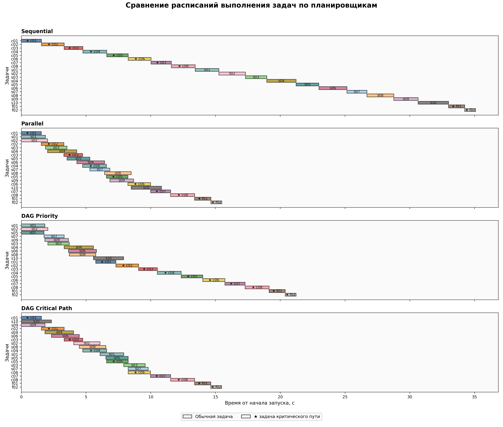

# Scheduler

Планировщик задач с зависимостями (DAG) для ограниченного числа исполнителей. Выпускная работа МФТИ «Разработка системы планирования и балансировки нагрузки в условиях ограниченного числа вычислительных ресурсов».

Задачи описываются в JSON: длительность, приоритет, зависимости, требования по CPU, памяти и сети. Каждая задача запускается отдельным процессом на пуле исполнителей.

## Стратегии планирования

| Планировщик | Как выбирает следующую задачу |
|---|---|
| `sequential` | по одной, в порядке зависимостей (базовая линия) |
| `parallel` | любая готовая задача на любой свободный исполнитель |
| `dag_priority` | готовая задача с наибольшим пользовательским приоритетом |
| `dag_critical` | готовая задача с наибольшим b-level (по критическому пути) |

## Результаты (20 задач, 3 исполнителя)

| Планировщик | Время, с | Ускорение | Утилизация | Ср. ожидание, с |
|---|---|---|---|---|
| sequential | 35.5 | 1.00x | 33% | 11.2 |
| parallel | 15.8 | 2.25x | 76% | 2.0 |
| dag_priority | 21.4 | 1.66x | 55% | 1.4 |
| dag_critical | 15.6 | 2.27x | 75% | 2.1 |

Нижняя оценка времени — 15 с: максимум из длины критического пути и суммарной работы, делённой на число исполнителей. Параллельный планировщик и планировщик по критическому пути отстают от неё примерно на 1 с.



## Запуск

```bash
pip install -r requirements.txt
python main.py               # прогон планировщиков, результаты в CSV
python visualize_results.py  # графики в plots/
```

Через Docker:

```bash
docker build -t scheduler .
docker run --rm scheduler
```

## Структура

- `Include/Scheduler/IFaces/` — интерфейсы задачи, исполнителя и планировщика
- `Src/` — реализации планировщиков и исполнителей
- `Tests/benchmark_tasks.json` — тестовый набор задач
- `plots/` — графики сравнения
